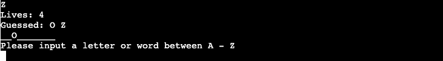

# Portfolio Project 3 - Python Essentials
## Welcome to the Hangman Game!
Here you can enjoy yourself and, at the same time, train your spelling with this popular guessing words game.

## Live Site
[Go to site](https://williams-hangman-game.herokuapp.com/) 

## Repository
[View repository](https://github.com/williamtyn/hangman) 

## Catalouge
<ul>
<li><a href="#target-group">Target Group</a></li>
<li><a href="#flowchart">Flowchart</a>
<li><a href="#how-to-play">How to play</a>
<li><a href="#features">Features</a>
<ul>
<li><a href="#welcome">Welcome</a></li>
<li><a href="#choose-nickname">Choose nickname</a></li>
<li><a href="#rules">See rules</a></li>
<li><a href="#random">Random word generated</a></li>
<li><a href="#guess-word">Guess word</a></li></ul>
<li><a href="#validation">Validation of input</a></li>
<li><a href="#lives-and-guess">Lives and guesses</a></li>
<li><a href="#win-or-game">Win or Game over</a></li>
<li><a href="#play-again">Play again?</a></li>
</ul>
<li><a href="#user-stories">User stories</a>
<li><a href="#bugs">Bugs</a></li>
<ul>
<li><a href="#solved-bugs">Solved Bugs</a></li>
</ul>
<li><a href="#future-features">Future features</a></li>
<li><a href="#technologies">Technologies</a></li>
<li><a href="#deployment">Deployment</a></li>
<li><a href="#credits">Credits</a></li>
<ul>
<li><a href="#code-issues">Issues with code</a></li>
<li><a href="#student-support">Student Support</a></li>
<li><a href="#code">Code</a></li></ul>
<li><a href="#acknowledgements">Acknowledgements</a></li></ul>
</li>
</ul>

<h2 id="target-group">Target Group</h2>
The Hangman game is for both educational use and fun. Because you can train your spelling, one of the main target groups is schools that want a fun way of teaching students the spelling of words.

<h2 id="flowchart">Flowchart</h2> 
To have some structure and to be able to understand which codes and functions the program would have, I have created a flowchart using

[Lucid](https://lucid.app/).

In the flowchart, you can see the whole process from start to finish. All the code is based on the flowchart, and beyond that, I also added a function to choose a nickname for the player.

<h2 id="how-to-play">How to play</h2>

<h2 id="features">Features</h2>
<h3 id="welcome">Welcome</h3>
The player can see the text "Welcome to Hangman Game" and the visual Hangman printed.

<h3 id="choose-nickname">Choose nickname</h3>
The player must choose their nickname and player name to play the game.

<h3 id="rules">See rules</h3>
If the player has never played before or doesn´t remember the rules, they get an option to see the rules before they start the game. If the player don´t want to see the rules, the game starts.

<h3 id="random">Random words generated</h3>
We collected a list with over 100 different words that the program randomly picks from. The program also hides the letters in the words until the player has guessed the correct letter.

<h3 id="guess-word">Guess word</h3>
As a player, you can choose to guess a letter from the alphabet or you can guess the word. Every letter you guess gets added to your guessed letters list. If the letter is in the word, the letter gets displayed in the right position and the player doesn´t lose any lives.

<h3 id="validation">Validation of input</h3>
The player can only guess letters between A to Z in the alphabet and receive a message saying "Your guess can only contain letters A - Z. Try again!" if they try anything else. The player doesn´t lose any lives in this case.

If the player guesses a letter that they have already guessed, they receive a message saying "You have already guessed (and the letter). The player doesn´t lose any lives in this case.

If the letter is in the alphabet, it is not in the previous guesses or in the word. The player loses a life.

<h3 id="lives-and-guess">Lives and guesses</h3>
The player has 5 lives, as mentioned above. If the letter validation is correct and the letter is not in the word, the player loses a life.

All guessed letters get added to the guessed letters list, as the player can always see.

<h3 id="win-or-game">Win or Game over</h3>
The player wins the game when the guess is the correct word and they still have lives left. They can see the print of "You Win" with asterisks.

If the player doesn't have any lives left, they get the message "Game Over" with asterisks.

<h3 id="play-again">Play again</h3>
After every run, win or game over, the player gets the question if they want to play again. If they want to play again, the program runs again from the point where it picks a random word.

If a player doesn't want to play again, the program ends.

<h2 id="user-stories">User stories</h2>

### User Story 1
As a player i want to play a wordgame against the computer to improve my spelling of english words.

*The player get the opportunity to improve their spelling of words in the hangman game. They player get hints of the word when the guess a letter and need to both use their vocabulary and spelling to guess the right word.*

### User Story 2
As a player i want to be able to to choose my own nickname or player name to feel more satisfied if i win the game.

*In the beginning of the game the player must choose a nickname to be able to play the game. If the player wins the get the Congrats message with their nickname, if they lose they get a well played message with their name.*

### User Story 3
As a player i want to be able to play the game many times with different words to keep practice my spelling.

*In the words list you find a lot of different word which reduces the risk of the random word to be picked again and at the same time the player get many different words to train their spelling with. At the end of each game the player have the option to play again " Do you want to play again? Y/N ".*

<h2 id="bugs">Bugs</h2>
If the player want to change their nickname they need to end and restart the whole program. If they choose to play again after win or lose the game repeats with the same nickname.

<h3 id="solved-bugs">Solved Bugs</h3>

<h2 id="future-features">Future features</h2>

### Change nickname
In the future a feature for changing nickname could be applied if someone else want to play without cancelling the program and start over.
<h2 id="technologies">Technologies</h2>

Random Words was genereated by [Randomlists.com](https://www.randomlists.com/)
To check spelling and grammar i used [Free Grammar Checker](https://quillbot.com/grammar-check)

<h2 id="deployment">Deployment</h2>

1. Log in to Heroku and create new app.
The first thing when deploying is to log in to [Heroku](https://dashboard.heroku.com/apps) and click new -> create app.

2. Give your app a name.
Then you need to select a new for your new app. I named my app "williams-hangman-game". Then select your region and press "Create App".

3. Add Config Vars
In the menu you click **settings** and then **Reveal Config Vars**. Input **PORT** as key and **8000** as value, press "Add".

4. Add buildpacks
Under config vars you can see **Buildpacks**. Click "Add buildpacks" and add python and nodejs (in that order). Click "Save changes".

5. Deploy section
Go to **Deploy** in menu and choose **GitHub** as your **Deployment Method**. Confirm that you want to connect to GitHub and search your repository name. For this project it is "Hangman". Click "connect" and link your repository to Heroku.

6. Deploy branch
Click "Deploy Branch" to manual deploy the site.

7. App successfully deployed
If everything is OK then you recieve "Your app was successfully deployed" and can click "View".

Because the online validator for PEP8 is currently offline. I´ve followed the steps that Kevin_ci on Code Institute provided.

As a workaround, you can add a PEP8 validator to your Gitpod Workspace directly by following these steps:
1. Run the command pip3 install pycodestyle  Note that this extension may already be installed, in which case this command will do nothing.
2. In your workspace, press Ctrl+Shift+P (or Cmd+Shift+P on Mac).
3. Type the word linter into the search bar that appears, and click on Python: Select Linter from the filtered results (image 1).
4. Select pycodestyle from the list (image 2).
5. PEP8 errors will now be underlined in red, as well as being listed in the PROBLEMS tab beside your terminal.

<h2 id="credits">Credits</h2>
<h3 id="code-issues">Issues with code</h3>
<h3 id="student-support">Student Support</h3>
<h3 id="code">Code</h3>
<h3 id="acknowledgements">Acknowledgements</h3>

William Tynér, October 2022.
[LinkedIn](https://www.linkedin.com/in/williamtyner/)